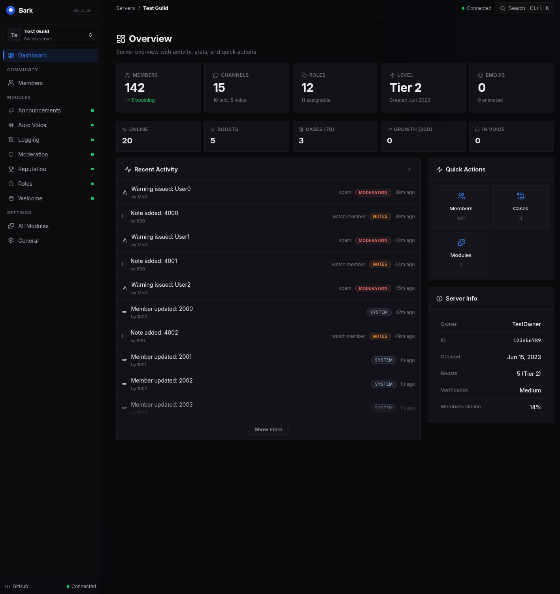

<div align="center">


# Bark

**Dashboard-first Discord server management.** Moderation, reputation, roles, and automation — self-hosted in a single asynchronous Python process.

[](https://github.com/warmbo/bark/actions/workflows/test.yml)


</div>

---

## Dashboard



Bark pairs the Discord client with a FastAPI + Jinja dashboard in one process, so server operators manage their community from the browser instead of chat commands. The UI is a glassmorphism design system with role-gated pages, live server-sent-event updates, and a shared module workspace — one cohesive application, not a pile of panels.

## Features

- **Moderation** — cases, warnings, private notes, timeouts, kicks, bans, voice actions, rulesets, and word lists
- **Reputation & levels** — message, emoji, reaction, voice, and thanks scoring with named tiers and leaderboards
- **Role management** — welcome, tenure, voice, Twitch-live, and reaction-claimed role rules
- **Auto voice** — dynamic temporary voice channels with configurable naming
- **Logging & welcome** — Discord event logging and member welcome automation
- **Live dashboard** — server/member search, audit history, activity summaries, and SSE updates
- **Modular by design** — per-server module enablement, JSON-schema configuration, and role-based access
- **Single process** — SQLite by default with async SQLAlchemy; one service to run, back up, and watch

## Modules

| Module | What it does |
|---|---|
| `announcements` | Scheduled announcements |
| `auto_voice` | Dynamic temporary voice channels |
| `help` | `/bark help` command reference DM |
| `logging` | Discord event logging |
| `moderation` | Cases, warnings, rulesets, voice tracking |
| `reputation` | Levels, thanks, reactions, voice, tiers |
| `role_manager` | Welcome/tenure/voice/Twitch/reaction roles |
| `speak` | `/bark speak <key>` preset phrases |
| `welcome` | Member welcome automation |

Every module subclasses `BarkModule` and declares its commands, events, settings schema, dashboard actions, and workspace tabs. See [Module workspace](docs/module-workspace.md) to build one.

**Plugins.** Extra functionality can be installed at runtime as single-file plugins — upload a `.py` file from the server's Modules page (Plugins box; owner-only) and it is registered and enabled immediately (no restart). Plugins follow the same `BarkModule` contract as built-in modules. See the [bark-plugins](https://github.com/warmbo/bark-plugins) repository for a ready-made set and the plugin format guide.

## Related repositories

- [**bark-site**](https://github.com/warmbo/bark-site) — the landing page at bark.warx.org (static HTML served on :8092; lists every core module).
- [**bark-plugins**](https://github.com/warmbo/bark-plugins) — single-file add-on plugins installed from the dashboard.
- `bark-dev` is not a separate repository: it is the **`dev` branch** of this repo, deployed as a second instance alongside `main`.

The self-update manager (`services/update_service.py`) always pulls from the **GitHub** mirror — stable channel tracks `main`, dev tracks `dev` — and refuses any update that would move the instance backwards (stale-mirror guard). The mirror must be kept in sync by the owner; Forgejo (`origin`) remains the authoritative push target.

## Quick start

Requires Python 3.13+. Bark is developed with `uv`; a plain venv + pip also works.

```bash
git clone https://github.com/warmbo/bark.git
cd bark
uv sync --extra dev
cp .env.example .env
```

Set the bot token (and the OAuth2 pair if you want Discord-login on the dashboard) in `.env` — every supported setting is documented there:

```dotenv
BARK_BOT_TOKEN=replace-with-your-discord-bot-token
BARK_PUBLIC_URL=https://bark.example.com
```

Run it:

```bash
uv run python app.py
```

The dashboard serves on `BARK_DASHBOARD_HOST:BARK_DASHBOARD_PORT` (default `127.0.0.1:8090`); health is at `/api/v1/health`. Add the `deploy/bark.service.example` systemd user unit for a persistent install, and terminate TLS at a reverse proxy in production.

## Dashboard access

Dashboard authorization has four ordered roles: `viewer < moderator < admin < owner`. Page and API authorization are both enforced — hiding a button is not a substitute for checking its route. Discord OAuth2 login is optional: with OAuth disabled the dashboard runs fully public for trusted local networks, with `BARK_OWNER_DISCORD_IDS` reserved for production deployments.

## Documentation

| Doc | Covers |
|---|---|
| [Architecture overview](docs/architecture-overview.md) | Process layout, module system, lifecycle |
| [API contracts](docs/api-contracts.md) | Route map, response envelope, pagination |
| [Permissions model](docs/permissions-model.md) | Role hierarchy and capability checks |
| [Data model](docs/data-model.md) | Persistent schema |
| [Dashboard UI](docs/dashboard.md) | Page/API control contract and audit checklist |
| [Design system](docs/design-system.md) | Visual tokens and layout primitives |
| [Module workspace](docs/module-workspace.md) | Standard module tab layout and behavior |
| [Moderation workflows](docs/moderation-workflows.md) | Case, warning, and voice flows |
| [Testing](docs/testing.md) | Test suite layout and conventions |

## Development

```bash
uv run pytest -v --tb=short
```

CI runs the full quality gate on every push and pull request: `ruff` lint + format, `mypy`, `bandit`, `pip-audit`, and `pytest`. Frontend code uses browser-native APIs and shared utilities instead of inline event handlers — when editing templates, preserve accessible labels, tab relationships, keyboard behavior, and loading/empty/error states.

## License

MIT
